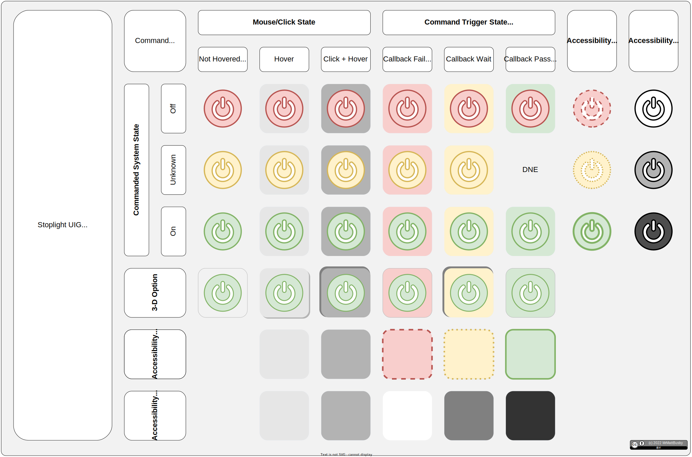

# StoplightUIG

A User Interface Guide (UIG) for providing system & function/callback, feedback & states via 🚦 icon fore/backgrounds.

# Principles

# License

 [StoplightUIG](https://github.com/MrMattBusby/StoplightUIG) © 2024 by [@MrMattBusby](https://github.com/MrMattBusby) is licensed under [CC BY 4.0](https://creativecommons.org/licenses/by/4.0/).
